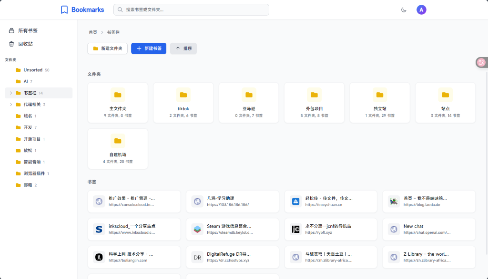
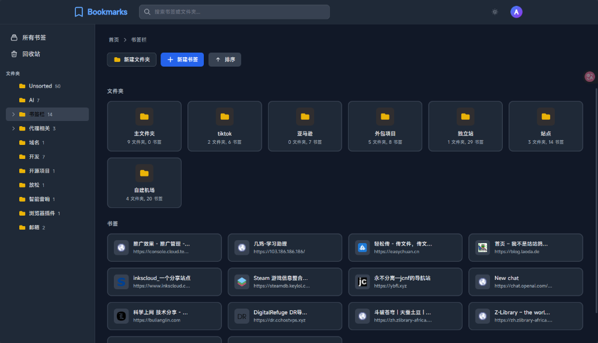
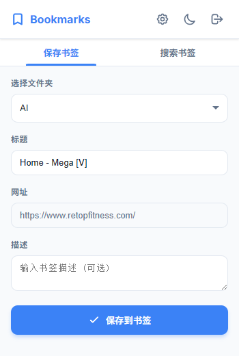
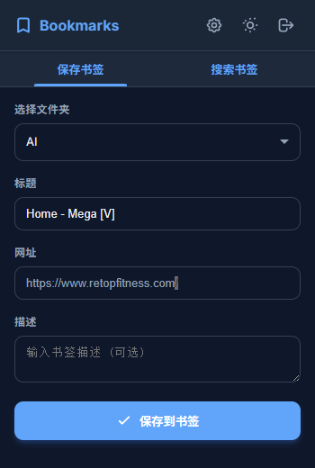

# Web Bookmarks Manager

 一个基于 Cloudflare Workers 和 D1 数据库构建的现代化书签管理系统。

<p align="center">
  
  
</p>
<p align="center">
  
  
</p>


## ✨ 功能特性

- 📁 **文件夹管理** - 创建、编辑、删除文件夹,支持嵌套结构
- 🔖 **书签管理** - 添加、编辑、删除书签
- 🗑️ **回收站** - 软删除机制,可恢复已删除的书签和文件夹
- 📤 **导入/导出** - 支持 Netscape HTML 格式的书签导入导出
- 🔐 **身份验证** - 基于 Cookie 的安全认证系统
- 🔒 **安全增强** - 输入验证、速率限制、SQL 注入防护
- 🎯 **自由排序** - 点击“排序”进入管理模式，拖拽项目进行重新排序
- ⚡ **无服务器架构** - 部署在 Cloudflare Workers，全球边缘网络加速
- 💾 **D1 数据库** - 使用 Cloudflare D1 SQLite 数据库存储数据
- 🚀 **性能卓越** - 侧边栏预计算书签数量，极速响应，即使书签再多也不卡顿

- 🎨 **主题皮肤** - 完美支持暗黑/亮色模式切换,保护视力
- 🧩 **浏览器扩展** - 跨浏览器插件,随时随地一键保存书签

## 🚀 技术栈

- **后端框架**: [Hono](https://hono.dev/) - 轻量级 Web 框架
- **运行时**: Cloudflare Workers
- **数据库**: Cloudflare D1 (SQLite)
- **前端**: 原生 HTML/CSS/JavaScript + Alpine.js
- **语言**: TypeScript

## 📋 使用前置要求

- Cloudflare 账号


## 📋 开发前置要求

- Node.js 20.x 或更高版本
- Wrangler CLI (Cloudflare 开发工具)


## 🚀 快速部署

### 方法一：一键部署 (推荐)

[](https://deploy.workers.cloudflare.com/target?url=https://github.com/WeirdStar0/web-bookmarks-)

点击上方的 **Deploy to Cloudflare Workers** 按钮。它会自动：
1. Fork/Clone 本仓库到你的账号。
2. 在 Cloudflare 中创建 Worker。
3. 自动创建并绑定 D1 数据库。

**部署后的结果：**
*   **零配置使用**：数据库、索引、管理员账号以及加密密钥 (`SECRET_KEY`) 均会在您首次访问页面时全自动初始化。
*   **即开即用**：部署完成后，直接访问您的 Worker URL 即可开始管理书签。

---

### 方法二：使用命令行部署 (适合开发)

1. **克隆并安装**
   ```bash
   git clone https://github.com/WeirdStar0/web-bookmarks-.git
   cd web-bookmarks-
   npm install
   ```

2. **初始化数据库**
   ```bash
   npx wrangler login
   npx wrangler d1 create bookmarks-db
   # 将输出的 database_id 填入 wrangler.toml (必须在 [[d1_databases]] 下填写)
   npm run migrate:remote
   ```

3. **设置密钥并部署**
   ```bash
   npx wrangler secret put SECRET_KEY
   npm run deploy
   ```

## 🛠️ 本地开发 (Local Development)

如果你想在本地环境中运行或贡献代码，请参考以下步骤：

### 1. 克隆与安装
```bash
git clone https://github.com/WeirdStar0/web-bookmarks-.git
cd web-bookmarks-
npm install
```

### 2. 配置本地数据库
```bash
# 创建本地 D1 数据库实例
npx wrangler d1 create bookmarks-db

# 运行 SQL 初始化表结构 (本地模式)
npx wrangler d1 execute bookmarks-db --local --file=./schema.sql
npx wrangler d1 execute bookmarks-db --local --file=./migrations/002_add_indexes.sql
```

### 3. 环境变量配置
创建 `.dev.vars` 文件用于本地存储密钥：
```bash
# 生成生成的随机密钥
openssl rand -base64 32
```
在 `.dev.vars` 中填入：`SECRET_KEY=你的随机密钥`

### 4. 启动开发服务器
```bash
npm run dev
```
访问 `http://localhost:8787`。默认账号：`admin` / 密码：`12345`

---

## 🔒 进阶配置

### 启用速率限制 (可选)
为了防止暴力破解，建议启用 KV 存储进行速率限制：
1. 创建 KV 命名空间：`npx wrangler kv:namespace create RATE_LIMIT_KV`
2. 将返回的 `id` 填入 `wrangler.toml` 中的 `kv_namespaces` 部分。
3. 重新运行 `npm run deploy`。

## 🧩 浏览器扩展 (Browser Extension)

项目配备了功能齐全的浏览器扩展程序,旨在提供极致的保存体验。

### ✨ 扩展功能
- **Premium UI**: 现代化的设计,基于 Inter 字体和 HSL 配色,支持丝滑的动效。
- **自定义主题**: 支持自动跟随系统或手动切换亮色/暗色模式。
- **智能保存**: 自动获取当前页面标题和网址,支持添加描述。
- **快速归类**: 自动记住上次选择的文件夹,并支持基于名称和 URL 的实时搜索。
- **Favicon 支持**: 搜索结果中实时显示网站图标,识别更快速。

### 📦 安装步骤
1. 打开 Chrome 浏览器,访问 `chrome://extensions/`
2. 开启右上角的“**开发者模式**”
3. 点击“**加载已解压的扩展程序**”
4. 在文件选择对话框中,选择本项目根目录下的 `extension` 文件夹

### ⚙️ 配置说明
1. 点击扩展程序图标,首次打开会进入设置页面
2. 在“服务器地址”中填入你部署的 Cloudflare Worker URL
3. 登录你的管理员账号,即可开始使用

---

## 💡 技巧与常见问题

### 1. 生成安全密钥 (SECRET_KEY)

```bash
# 使用 OpenSSL
openssl rand -base64 32

# 或使用 Node.js
node -e "console.log(require('crypto').randomBytes(32).toString('base64'))"
```

### 2. 登录后立即退出？
- 确保生产环境的 `SECRET_KEY` 已通过 `npx wrangler secret put SECRET_KEY` 设置，且与本地一致。
- 如果更换了密钥，请清除浏览器 Cookie 后重新登录。

### 3. 如何重置密码？
```bash
npx wrangler d1 execute bookmarks-db --remote --command="UPDATE settings SET value='newpassword' WHERE key='password'"
```

### 4. 速率限制不生效？
- 确保已创建 KV 命名空间：`npx wrangler kv:namespace create RATE_LIMIT_KV`
- 确保 `wrangler.toml` 中已正确绑定该 KV。

## 🔧 配置说明

### wrangler.toml

主要配置文件,包含:
- Worker 名称
- D1 数据库绑定
- 兼容性日期

### 环境变量

如需使用环境变量,创建 `.dev.vars` 文件(本地开发):

```
# .dev.vars
SECRET_KEY=your-secret-key
```

## 📖 API 文档

### 认证相关

- `POST /api/login` - 用户登录
- `POST /api/logout` - 用户登出
- `PUT /api/settings` - 更新用户名和密码

### 数据管理

- `GET /api/data` - 获取所有文件夹和书签
- `GET /api/trash` - 获取回收站内容

### 文件夹操作

- `POST /api/folders` - 创建文件夹
- `PUT /api/folders/:id` - 更新文件夹
- `DELETE /api/folders/:id` - 删除文件夹(软删除)
- `POST /api/restore/folders/:id` - 恢复文件夹
- `DELETE /api/trash/folders/:id` - 永久删除文件夹

### 书签操作

- `POST /api/bookmarks` - 创建书签
- `PUT /api/bookmarks/:id` - 更新书签
- `DELETE /api/bookmarks/:id` - 删除书签(软删除)
- `POST /api/restore/bookmarks/:id` - 恢复书签
- `DELETE /api/trash/bookmarks/:id` - 永久删除书签

### 排序操作 (新增)

- `PUT /api/folders/reorder` - 批量更新文件夹顺序
- `PUT /api/bookmarks/reorder` - 批量更新书签顺序 (基于时间戳)

### 导入导出

- `GET /api/export` - 导出书签为 HTML 格式
- `POST /api/import` - 导入 Netscape HTML 格式书签

## 🗄️ 数据库结构

### folders 表

| 字段 | 类型 | 说明 |
|------|------|------|
| id | INTEGER | 主键 |
| name | TEXT | 文件夹名称 |
| parent_id | INTEGER | 父文件夹 ID |
| sort_order | INTEGER | 排序权重 (越小越靠前) |
| is_deleted | INTEGER | 是否已删除 (0/1) |
| created_at | TIMESTAMP | 创建时间 |

### bookmarks 表

| 字段 | 类型 | 说明 |
|------|------|------|
| id | INTEGER | 主键 |
| title | TEXT | 书签标题 |
| url | TEXT | 书签 URL |
| description | TEXT | 描述 |
| folder_id | INTEGER | 所属文件夹 ID |
| is_deleted | INTEGER | 是否已删除 (0/1) |
| created_at | TIMESTAMP | 创建时间 |

### settings 表

| 字段 | 类型 | 说明 |
|------|------|------|
| key | TEXT | 设置键 (主键) |
| value | TEXT | 设置值 |

## 🔒 安全建议

1. **修改默认密码**: 部署后立即登录并修改默认的用户名和密码
2. **使用 HTTPS**: Cloudflare Workers 默认提供 HTTPS
3. **定期备份**: 定期导出书签数据作为备份
4. **API Token 安全**: 不要将 Cloudflare API Token 提交到代码库

## 🤝 贡献

欢迎提交 Issue 和 Pull Request!

## 📄 许可证

ISC License


## 📞 支持

如有问题,请提交 [Issue](https://github.com/YOUR_USERNAME/web-bookmarks/issues)

---

⭐ 如果这个项目对你有帮助,请给个 Star!
